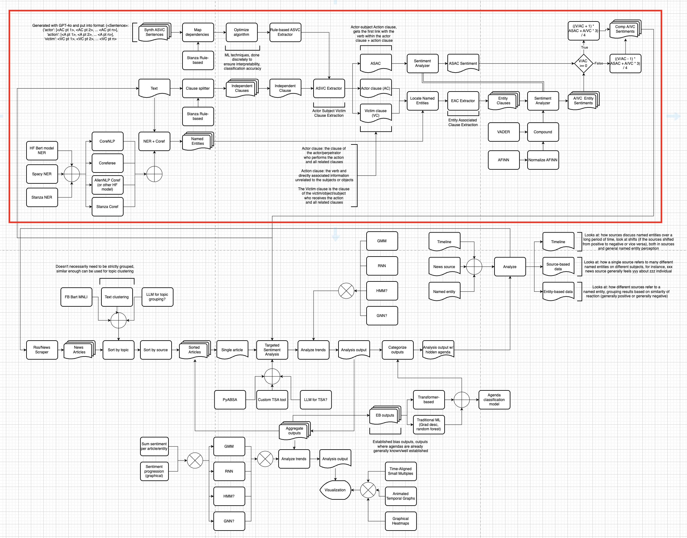

# Entity Targeted Sentiment Analysis (Quantum Criticism)
Part of the Quantum Criticism Research Project.

## Overview
Entity-Targeted Sentiment Analysis (ETSA) is a tool designed to quantify and visualize how sentiment toward specific entities evolves within individual news articles, and how those intra-article trends aggregate over time. By focusing on Actor–Subject–Victim (ASVC) structures and rule-based extraction, ETSA delivers an explainable pipeline that can be integrated into a full-stack application for end-to-end agenda detection.

## Architecture
### ETSA Pipeline (Isolated)

### ETSA Pipeline (Part of QC)

