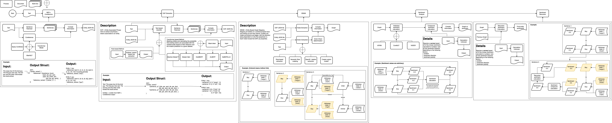

# Entity Targeted Sentiment Analysis (Quantum Criticism)
Part of the Quantum Criticism Research Project with: Assistant Professor David Guy Brizan, Alex Pezcon, and Harry Yin (MAGICS Lab @ University of San Francisco)

## Overview
A unified, graph-centric pipeline for tracking how sentiment attaches to—and evolves around—entities and their aspects within any text. ETSA processes raw sentences one by one, builds a dynamic property graph of entities and descriptive phrases, scores sentiment at multiple levels, and propagates those scores through tunable, explainable message-passing.

## Key Features

- **Hybrid Aspect Extraction**  
  Combines high-precision dependency-rule seeds with a lightweight span-classifier to capture single- and multi-word aspects.

- **Unified Entity–Aspect Graph**  
  Nodes represent entities (coreference clusters) and aspect phrases; edges encode syntactic/semantic relations, possession, coordination, and more.

- **Multi-Granular Sentiment Scoring**  
  Phrase-level (EAP), entity/aspect-level, and document-level sentiment, with separate “direct” and “propagated” attributes.

- **Explainable Propagation**  
  Iterative α/β-damped message-passing that logs each neighbor’s contribution, so you can trace exactly how sentiment shifts occur.

- **Temporal & Recency-Aware Updates**  
  Incrementally add new sentences to the graph and apply time-decay weighting to emphasize the latest sentiment changes.

- **Sentiment-Informed Coreference Feedback**  
  Use global sentiment consistency to refine coreference clusters, improving long-range entity tracking.

- **Modular & Swappable**  
  Plug in any NER, coref, sentiment model (spaCy, AllenNLP, custom Transformers) or graph backend (NetworkX, Neo4j, PyG) without changing the pipeline glue.

## ETSA Pipeline Overview

1. **Text Ingestion** → sentence segmentation  
2. **Entity Recognition & Coref** → cluster mentions  
3. **EAP Extraction** → dependency-rule seeds + span classification  
4. **Graph Construction** → build property graph with nodes & edges  
5. **Sentiment Scoring** → assign polarity to phrases & aggregate  
6. **Message-Passing** → propagate scores with explainable logs  
7. **Temporal Aggregation** → apply decay & update graph  
8. **Coref Feedback** → merge or split clusters based on sentiment

ETSA delivers a transparent, high-fidelity view of how opinions and feelings flow through narratives—ideal for literary analysis, social media monitoring, or any application where understanding “who feels what, when” matters.  
